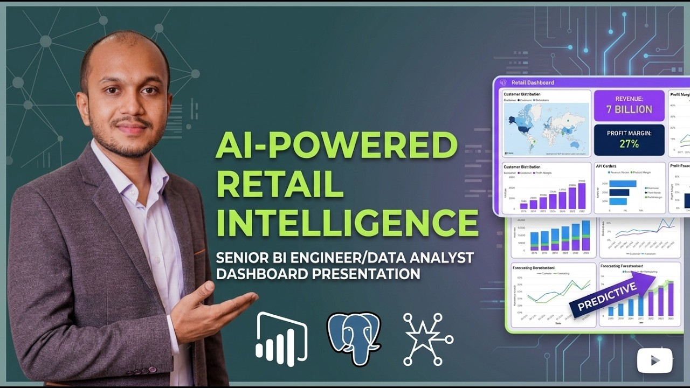

# AI-Powered Business Intelligence Platform

An end‑to‑end Business Intelligence project that simulates how modern
companies transform raw operational data into predictive insights.\
The system integrates **data engineering, data warehousing, machine
learning, API deployment, and Power BI dashboards**.

Pipeline overview:

Raw Data → Data Warehouse → Machine Learning → API → Executive Dashboard

------------------------------------------------------------------------

# Executive Summary

Retail companies generate massive amounts of operational data from sales
systems, inventory platforms, logistics tracking, and customer
transactions.\
However, without a centralized analytics platform, decision makers
struggle to extract insights from this data.

This project simulates a modern analytics platform that:

• Centralizes retail data into a **PostgreSQL data warehouse**\
• Uses a **Star Schema** for analytical performance\
• Builds **machine learning demand forecasting models**\
• Deploys predictions through an **API endpoint**\
• Visualizes insights using **Power BI dashboards**

The result is a system that demonstrates how businesses can move from
**basic reporting to predictive analytics**.

------------------------------------------------------------------------

# Business Problem

Retail organizations constantly need answers to questions such as:

• Which products generate the most revenue?\
• Which regions drive the most sales?\
• Which product categories are most profitable?\
• How will demand change in the future?

Without a unified analytics platform, these insights remain hidden
across separate operational systems.

This project addresses that challenge by building a **centralized BI
system** that structures data and provides decision‑ready insights.

------------------------------------------------------------------------

# Methodology

## Dataset Simulation

A synthetic enterprise retail dataset was created including:

Customers\
Products\
Orders\
Order Items\
Payments\
Shipments\
Inventory\
Vendors\
Marketing Campaigns

The dataset is **multi‑table, relational, time‑series based, and region
aware**, simulating a real production system.

------------------------------------------------------------------------

## Data Warehouse Architecture

All data is stored in **PostgreSQL** using a layered warehouse design:

Raw Layer -- direct ingestion\
Staging Layer -- cleaning and transformation\
Warehouse Layer -- structured business tables\
Analytics Layer -- KPI tables for dashboards

A **Star Schema** was implemented with:

Fact Table\
• fact_sales

Dimension Tables\
• dim_customer\
• dim_product\
• dim_region\
• dim_time

------------------------------------------------------------------------

## Machine Learning Forecasting

Historical sales data is used to forecast demand using time‑series
models.

Steps include:

• Feature engineering (lags, rolling averages)\
• Model training (Prophet / XGBoost)\
• Model evaluation\
• Model saving for reuse

This allows predictive demand planning for supply chain optimization.

------------------------------------------------------------------------

## Forecasting API

A **Flask/FastAPI API** exposes the forecasting model.

The API:

1.  Connects to PostgreSQL\
2.  Loads the trained model\
3.  Generates predictions\
4.  Returns forecasts via endpoint

Example endpoint:

/forecast

------------------------------------------------------------------------

# Dashboard Preview

### Executive Business Overview

### Sales Forecasting Dashboard

### Operations & Inventory Dashboard

Documentation : https://github.com/sharifashik591/AI-Powered-Business-Intelligence-Platform/blob/master/Dashboard/Professional_Retail_Intelligence_Documentation.pdf

------------------------------------------------------------------------

# Skills Demonstrated

Data Engineering
- SQL ETL pipelines
- Data cleaning and transformation

Data Warehousing
- PostgreSQL warehouse design
- Star schema modeling

Machine Learning
- Time‑series forecasting
- Feature engineering

Visualization
- Power BI dashboards
- Business KPI monitoring

Backend
- API development using Flask / FastAPI
- Model deployment

------------------------------------------------------------------------

# Results & Business Recommendations

The platform generates insights that support business decisions.

Revenue Insights
- Identify top products and regions driving revenue.

Demand Forecasting
- Predict future demand to improve procurement planning.

Profitability Analysis
- Highlight high‑margin products for marketing focus.

Operational Monitoring
- Track inventory distribution and delivery performance.

------------------------------------------------------------------------

# Next Steps

Possible improvements include:

• Real‑time streaming pipelines (Kafka)
• Workflow automation using Airflow
• Advanced deep learning forecasting models
• Cloud deployment (AWS / GCP / Snowflake)
• CI/CD pipelines for ML deployment

------------------------------------------------------------------------

# Installation

Clone repository

* git clone https://github.com/sharifashik591/AI-Powered-Business-Intelligence-Platform

Create environment

* python -m venv env

Install dependencies

* pip install -r requirements.txt

Run API

* python ML_Layer/Demand_Forecasting/app.py

API runs at:

* http://127.0.0.1:5000

------------------------------------------------------------------------

# Project Value

This project demonstrates the ability to design a **complete end‑to‑end
analytics solution**, covering:

* Data engineering
* Data warehouse architecture
* Machine learning forecasting
* API deployment
* Executive BI dashboards

# Watch Video
(https://youtu.be/JfOyOsM-ACg)

